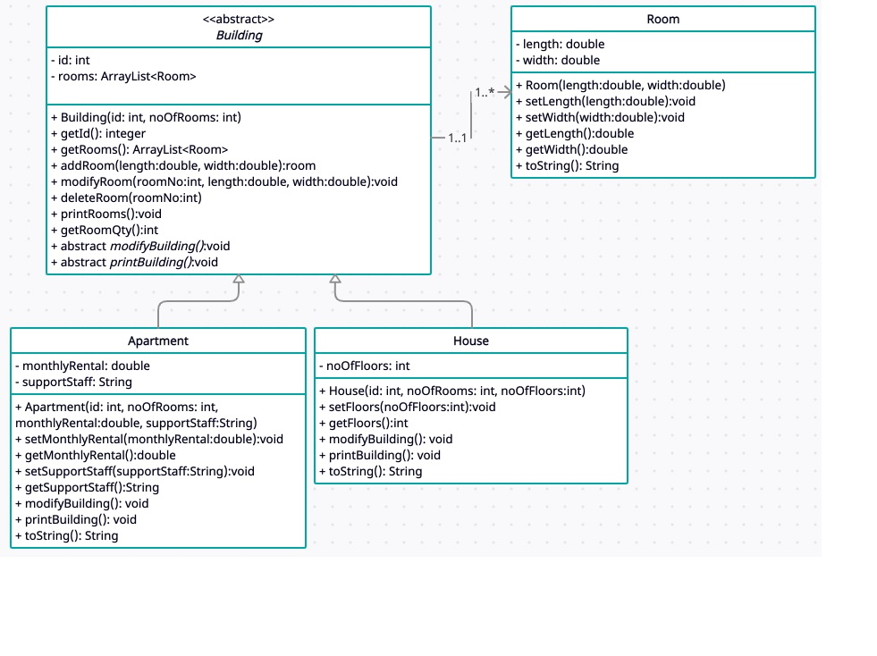

# Building Management System (BMS)

A robust Java-based Building Management System that implements various design patterns to maintain and manage different types of building records efficiently.

## Overview

This Building Management System (BMS) is designed to handle various types of buildings (currently supporting Apartments and Houses) with a flexible architecture that allows for easy extension to support new building types in the future. The system implements several design patterns to ensure maintainability, extensibility, and clean code structure.

## Features

- **Building Management**
  - Create new building records (Apartments, Houses)
  - Modify existing building records
  - Display building details by ID (or all buildings)
  - Support for future building types

- **Room Management**
  - Add new rooms to buildings
  - Update existing room information
  - Delete rooms from buildings

- **Command History**
  - Undo last command
  - Redo previously undone commands
  - View command history

## Architecture & Design Patterns

The system implements several design patterns to achieve a flexible and maintainable architecture:

1. **Command Pattern**
   - Encapsulates each operation as an object
   - Enables undo/redo functionality
   - Implemented through command classes (e.g., `AddCommand`, `ModifyBuildingCommand`, `DeleteRoomCommand`)

2. **Factory Pattern**
   - Creates command objects through factory classes
   - Provides a centralized way to instantiate commands
   - Implemented via various command factory classes (e.g., `CommandFactory`, `AddCommandFac`)

3. **Memento Pattern**
   - Preserves building and room states for undo/redo operations
   - Implemented through memento classes (e.g., `BuildingMemento`, `RoomMemento`)

4. **CareTaker Pattern**
   - Manages the history of commands and states
   - Handles undo/redo operations

## Class Structure

The system is organized into several key components:

- **Building Classes**
  - `Building.java` (Abstract base class)
  - `Apartment.java`
  - `House.java`
  - `Room.java`

- **Command Classes**
  - `Command.java` (Interface)
  - Various command implementations (Add, Modify, Delete, etc.)
  - Command factory classes

- **Memento Classes**
  - `Memento.java` (Interface)
  - Building and room-specific memento implementations

- **Utility Classes**
  - `CareTaker.java` (Manages command history)
  - `VectorItem.java` (Data structure for building records)

## Class Diagram



## Getting Started

### Prerequisites

- Java Development Kit (JDK) 8 or higher
- Any Java IDE (Eclipse, IntelliJ IDEA, etc.)

### Running the Application

1. Clone the repository
2. Compile the Java files:
   ```bash
   javac *.java
   ```
3. Run the main application:
   ```bash
   java Main
   ```

## Usage Examples

### Creating a Building
```
Enter command: add
Enter building type (apartment/house): apartment
Enter building ID: A001
Enter number of rooms: 3
```

### Displaying Building Details
```
Enter command: display
Enter building ID (or * for all): A001
```

### Modifying a Building
```
Enter command: modify
Enter building ID: A001
Enter new number of rooms: 4
```

### Undo/Redo Operations
```
Enter command: undo
Enter command: redo
```


